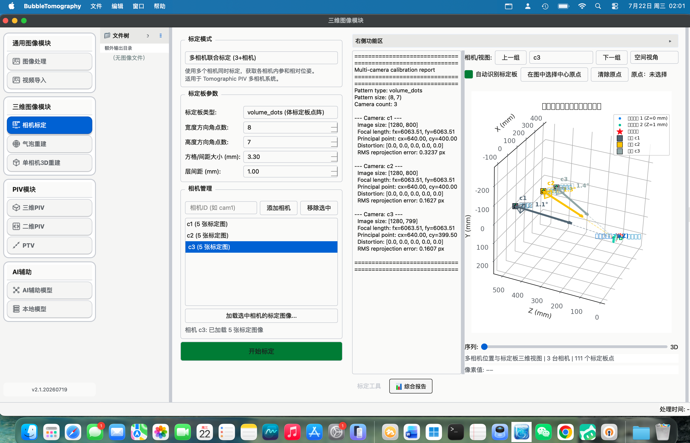
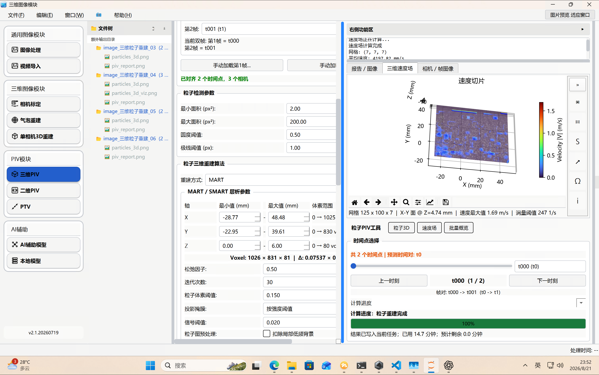

# MISTA

直接进行安装包安装，可以不安装整体opencv库。安装包在这里：
通过网盘分享的文件：bubble_tomography_install
链接: https://pan.baidu.com/s/1sgALkEd2siHkAyQYCbVsZg 提取码: vvf5 
https://weixin.qq.com/sph/A5dasRwBTV
**多相流科研图像处理、三维重建与 PIV/PTV 分析工作站**


当前版本：`v2.3.20260901`  
支持平台：Windows 10/11 x64；提供 macOS 构建脚本

MISTA 将实验图像管理、图像处理工作流、视频/CINE 导入、多相机标定、气泡与粒子三维重建、二维/三维 PIV、PTV 以及 AI 辅助分析整合在同一个桌面应用中。软件面向高速摄影、多相流、气泡动力学和粒子测速实验，支持单图交互调参，也支持保持参数一致的目录批处理。

> 科研提示：重建与测速结果会受到标定质量、相机同步、粒子密度、时间间隔和处理参数影响。正式实验应保存原始数据、标定文件和项目记录，并对结果进行独立验证。

## 主要功能

| 模块 | 功能 |
|---|---|
| 图像处理 | 文件树联动、单图/批量目录模式、可编排工作流、ROI、镜像、旋转、位深与灰度运算、滤波、阈值、分割、FFT/IFFT、图像质量、粒子统计、气泡识别与追踪、自定义算法、点云与速度场分析、图片/视频导出 |
| 视频导入 | CINE、MP4、MOV、AVI、MKV、MXF 等视频预览，亮度/增益/伽马、裁剪、翻转、帧范围选择和停止导出 |
| 相机标定 | 单相机、双相机和 3 台及以上相机联合标定；棋盘格、对称/非对称圆点阵和 LaVision 双层体标定板点阵；标定结果导入与导出 |
| 气泡重建 | 多相机图像批量加载，MART/SMART 等层析重建，体素、切片和点云结果输出 |
| 单相机 3D 重建 | 基于轮廓与光线追踪的三维重建和点云导出 |
| 三维 PIV | 粒子体重建、多级互相关、自动分块与内存规划、并行计算、批量速度场、切片/云图/矢量/涡量面显示 |
| 二维 PIV | 单组与批量互相关、矢量过滤、密度和显示参数调整、结果导出 |
| PTV | 多相机粒子检测、三维匹配、轨迹连接和速度计算 |
| AI 辅助模型 | 普通对话、图像上下文、自然语言任务规划和图像处理工作流建议 |
| 本地模型 | OpenAI 兼容接口与本地 GGUF 模型配置，可配合 LM Studio 提供离线对话服务 |
| 相机采集 | 通用相机入口及 Phantom 相机采集页面；实际采集能力取决于相机和厂商 SDK |

## 推荐操作流程

### 图像处理

统一流程为：

```text
选择数据 -> 单图预览 -> 调整工作流 -> 批量执行 -> 检查输出结果
```

1. 在左侧文件树中设置工作目录。
2. 选择一张图片时，软件自动进入“单张图像”模式，仅处理当前图片；参数变化会实时刷新预览。
3. 选择文件夹时，软件自动进入“批量目录”模式，按自然顺序载入第一张有效图片作为预览帧。
4. 从“操作功能区”把算法加入工作流；选中工作流节点后，在下方“编辑参数”区域调节参数。
5. 批量模式调参时只重新计算当前预览图，不会重复处理整个目录。可通过序列控制栏切换预览帧。
6. 输出目录默认建议为输入文件夹内的子目录，名称由“输入文件夹名称 + 工作流缩写”组成。例如 `Experiment01_C-M-B`。
7. 只有点击“批量处理”后才创建输出目录。处理期间工作流结构和参数会被锁定，并显示当前文件、完成数量、耗时和异常信息。

文件树支持复制、移动、重命名、删除和复制路径等右键操作，也支持拖拽移动文件或文件夹。移动文件夹时会保留其内部目录结构。删除和移动实验原始数据前请先做好备份。

支持的常用图像格式：`.png`、`.jpg`、`.jpeg`、`.bmp`、`.tif`、`.tiff`、`.pgm`、`.ppm`。

### 多相机标定与三维 PIV

1. 在“相机标定”中选择标定模式和标定板类型。
2. 为每台相机加载清晰、完整且对应关系正确的标定图像。
3. LaVision 双层板应选择 `volume_dots`，并按板型填写点距和层间距，例如 204-15 为点距 15 mm、层间距 3 mm。
4. 检查每台相机的识别点覆盖、编号方向、重投影误差和相机空间布局。
5. 导出标定结果，并在“三维 PIV”中导入。
6. 按相机批量加载同步粒子图像，设置第 1/第 2 帧、物理重建范围、体素数、MART 参数和内存预算。
7. 先进行小体素或局部区域试算，再执行完整粒子 3D 重建和多级互相关速度场计算。
8. 在结果区选择 X-Y、X-Z 或 Y-Z 切片，并调整矢量密度、长度、单位、云图变量、色阶和涡量面。

大体素任务会自动进行分块和内存规划。建议预留系统内存，并在“CPU/GPU 调度”中为系统保留 1 至 2 个逻辑核心。显卡加速为可选能力，无独立显卡时可使用 CPU 模式。

### 气泡识别与追踪

1. 在图像处理工作流中加入 `BubAnalysis 气泡识别`。
2. 根据图像调整背景、阈值、轮廓和重叠气泡分割参数。
3. 批量执行后会生成标注图和 `*_bubbles.csv`。
4. 将“气泡追踪”加入工作流，读取上述结果目录，生成气泡轨迹、事件与速度结果。

## 安装与启动

### Windows 安装包

安装包默认输出到相邻目录：

```text
D:\Code\BubbleandPIV\bubble_tomography_install\MISTA_Setup_v2.3.20260901_x64.exe
```

运行安装程序后，从开始菜单或桌面快捷方式启动 `MISTA`。LM Studio、本地 GGUF 模型运行环境和 NVIDIA 驱动属于可选组件；普通 CPU 计算不要求独立显卡。

### Windows 便携版

标准便携目录为：

```text
dist\MISTA\
├── MISTA.exe
└── _internal\
```

复制到其他电脑时必须整体复制 `dist\MISTA`，不能只复制 `MISTA.exe`。项目根目录中的 `MISTA.exe` 同样依赖相邻的 `_internal` 目录。

### 从源码运行

建议使用 Python 3.11 x64：

```powershell
python -m venv .venv
.\.venv\Scripts\Activate.ps1
python -m pip install --upgrade pip
python -m pip install -r requirements.txt
python main.py
```

常用命令：

```powershell
python main.py --gui       # 启动图形界面；无参数时也是 GUI
python main.py --demo      # 运行气泡层析演示
python main.py --piv-demo  # 运行 Tomographic PIV 演示
python main.py --verbose   # 输出更详细的启动日志
```

## 数据组织示例

多相机时间序列推荐使用“相机目录 + 自然排序文件名”：

```text
Experiment01/
├── cam1/
│   ├── frame_0000.tif
│   └── frame_0001.tif
├── cam2/
│   ├── frame_0000.tif
│   └── frame_0001.tif
└── cam3/
    ├── frame_0000.tif
    └── frame_0001.tif
```

部分批量重建入口也支持“时间点目录 + 相机文件”：

```text
Experiment01/
├── t000/
│   ├── cam1.tif
│   ├── cam2.tif
│   └── cam3.tif
└── t001/
    ├── cam1.tif
    ├── cam2.tif
    └── cam3.tif
```

所有相机必须使用相同的时间点集合。建议使用固定宽度编号，如 `0000`、`0001`，避免不同系统的排序差异。

## 文件格式

| 数据 | 输入/输出格式 |
|---|---|
| 图像 | PNG、JPEG、BMP、TIFF、PGM、PPM |
| 视频 | CINE、MP4、MOV、AVI、MKV、MXF、WMV、MPG/MPEG、M4V |
| 图像导出 | PNG、JPEG、BMP、TIFF、WebP |
| 视频导出 | MP4、AVI、MOV、MKV |
| 点云 | PLY、PCD、PTS、XYZ、OBJ、CSV/TXT、NPY/NPZ |
| 速度场 | VTK、NPZ、NPY、CSV/TXT |
| 项目记录 | `.btproject` |
| 标定结果 | JSON |

## 项目结构

```text
bubble_tomography/
├── main.py                 # 程序入口与演示命令
├── gui/                    # PyQt5 主界面、采集和分析组件
├── calibration/            # 单/双/多相机标定
├── mart/                   # MART、SMART、分块重建与射线模型
├── particles/              # 粒子三维重建、二维/三维速度场
├── ptv/                    # PTV 检测、匹配、追踪与速度计算
├── raytrace/               # 单相机轮廓光线追踪重建
├── utils/                  # 图像、视频、CINE、气泡分析和项目记录
├── visualization/          # 点云、切片、速度场与报告输出
├── tests/                  # 自动化测试
├── scripts/                # 打包、巡览视频和辅助脚本
├── installer/              # Inno Setup 安装配置
├── assets/                 # 图标和界面资源
├── requirements.txt        # Windows/Python 依赖
└── mista.spec              # PyInstaller 配置
```

## 构建发布版本

### 便携 EXE

```powershell
.\scripts\build_portable.ps1
```

完全重建虚拟环境：

```powershell
.\scripts\build_portable.ps1 -RecreateVenv
```

仅复用已验证的构建环境：

```powershell
.\scripts\build_portable.ps1 -SkipDependencyInstall
```

构建完成后会生成 `dist\MISTA\MISTA.exe`，并把便携运行时同步到项目根目录。

### Windows 安装包

先生成 `dist\MISTA`，再使用 Inno Setup 6 编译：

```powershell
& "C:\Program Files (x86)\Inno Setup 6\ISCC.exe" ".\installer\MISTA.iss"
```

安装包配置可选打入 LM Studio 和 NVIDIA 驱动。打包前应确认 `installer\MISTA.iss` 中声明的可选安装文件实际存在。

## 测试

运行完整测试：

```powershell
python -m pytest -q
```

运行打包程序的启动检查：

```powershell
.\dist\MISTA\MISTA.exe --smoke-test
```

生成自动页面巡览、截图、视频和功能报告：

```powershell
python .\scripts\create_feature_tour.py `
  --test-data-root D:\Code\BubbleandPIV\git_bubble_tomography\image_for_test `
  --output-dir .\artifacts\MISTA_feature_tour
```

测试报告会明确区分软件功能、外部 API、本地模型和相机硬件等受限条件。

## 常见问题

### 软件停在启动画面或提示主窗口初始化失败

查看日志：

```text
%LOCALAPPDATA%\MISTA\logs\startup.log
```

不要把程序安装到需要写入权限且被策略限制的目录中。运行结果和日志应保存到用户可写目录；若安全软件拦截，可将便携版放在本地可信路径后重试。

### CINE 文件无法读取

MISTA 支持 RAW 和软件已实现解码的压缩 CINE 类型。CINE 编码随相机型号和 Phantom 软件版本变化；遇到不支持的压缩方式时，请保留原文件和错误中的 `compression` 编号，或先用厂商软件导出为无损 TIFF 序列。

### 体标定板无法自动识别

确认选择 `volume_dots`、板型尺寸正确、亮点未饱和且完整入镜。先逐相机检查识别叠加图；编码点、三角/方形方向标记和双层点的方向错误会导致相机姿态翻转或编号不一致。

### 三维速度场过于稀疏

速度网格由最终互相关窗口、重叠率、有效重建区域和 SNR 筛选共同决定，并不等同于 MART 体素数。缩小最终窗口、提高 overlap 会增加网格密度，同时显著增加计算量和内存占用。

### 本地模型不能对话

确认 LM Studio 或其他 OpenAI 兼容服务已启动，API 地址和模型 ID 正确。使用 GGUF 时先在本地服务中加载模型；安装包不会自动包含体积较大的模型文件。

## 算法参考

MART/ART 方法的基础参考：

> Gordon, R., Bender, R., & Herman, G. T. (1970). Algebraic reconstruction techniques (ART) for three-dimensional electron microscopy and X-ray photography. *Journal of Theoretical Biology*, 29(3), 471-481.

## 许可与贡献

请以项目实际附带的许可文件和发布约定为准。提交修改前请运行相关测试，并避免把实验原始数据、模型文件、驱动安装包、构建目录或用户密钥提交到版本库。
